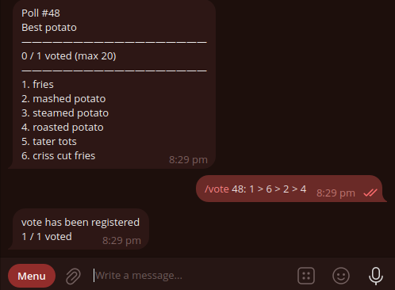

My original plans for user input into my
[ranked choice voting telegram bot](https://github.com/milselarch/RCV-tele-bot)  
was to have everything be done via text commands:

But after getting complaints about text input for voting being
unintuitive, I went to
