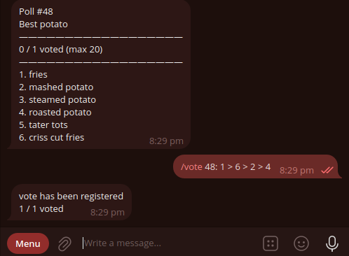
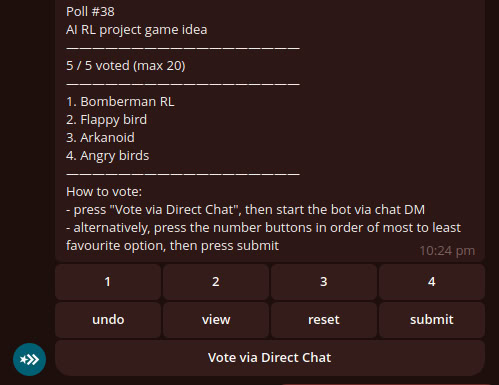
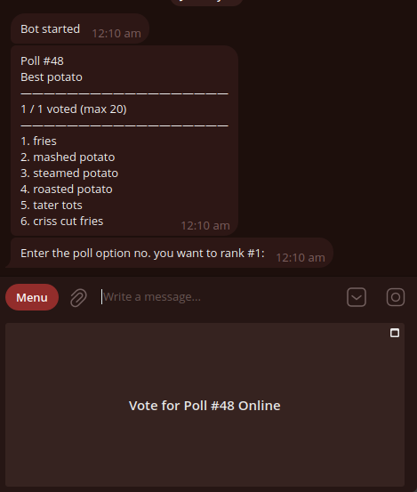

My original plan for user input into my
[ranked choice voting telegram bot](https://github.com/milselarch/RCV-tele-bot)
was to have all actions be done via text commands:



But after getting complaints about text input for voting being
unintuitive, and after learning about the possibility of [embedding
webapps within Telegram](https://core.telegram.org/bots/webapps)
itself, I thought I would try to leverage this to make a second
way from which users can cast votes.

## The chatbot backend

So in telegram there are three types of chats -
super chats, group chats, and private chats. We don't care about the
former at all, and you can't open a webapp from a group chat, but
for private chats you can create a
[`KeyboardButton`](https://docs.python-telegram-bot.org/en/stable/telegram.keyboardbutton.html)
that when clicked, will spawn a webapp with the url you specified
when creating said button.

```python:title=base_api.py
@classmethod
def build_private_vote_markup(
    cls, poll_id: int, tele_user: TeleUser,
    ref_message_id: int = BLANK_ID, ref_chat_id: int = BLANK_ID
) -> List[List[KeyboardButton]]:
    poll_url = cls.generate_poll_url(
        poll_id=poll_id, tele_user=tele_user,
        ref_message_id=ref_message_id, ref_chat_id=ref_chat_id
    )
    logger.warning(f'POLL_URL = {poll_url}')
    # create vote button for reply message
    markup_layout = [[KeyboardButton(
        text=f'Vote for Poll #{poll_id} Online',
        web_app=WebAppInfo(url=poll_url)
    )]]

    return markup_layout
```

[`🔗 base_api.py : 525`](https://github.com/milselarch/RCV-tele-bot/blob/6c17375577a3c28d9893a69a2cc3c2a72b1bf88d/base_api.py#L525)

Because this is just going to be a link to another webpage,
the only way to pass information to the web frontend about the user and the poll
would be via the link itself i.e. `GET` params that are
inserted into the link, hence why I pass in params like the poll id and
tele_user (to insert the user ID to query params) into `generate_poll_url`:

```python:title=base_api.py
@classmethod
def generate_poll_url(
    cls, poll_id: int, tele_user: TeleUser,
    ref_message_id: int = BLANK_ID, ref_chat_id: int = BLANK_ID
) -> str:
    ...
    req = PreparedRequest()
    auth_date = str(int(time.time()))
    query_id = cls.generate_secret()
    ...
    ref_info = f'{auth_date}:{poll_id}:{ref_message_id}:{ref_chat_id}'
    ref_hash = cls.sign_data_check_string(ref_info)

    params = {
        ...
        'ref_info': ref_info,
        'ref_hash': ref_hash
    }
    req.prepare_url(WEBHOOK_URL, params)
    return req.url
```

[`🔗 base_api.py : 492`](https://github.com/milselarch/RCV-tele-bot/blob/6c17375577a3c28d9893a69a2cc3c2a72b1bf88d/base_api.py#492)

The main thing that is being done here is the creation of a string payload `ref_info`
encoding the intended poll ID that the user wants to vote for, as well as
a couple of other fields, as well as a signature `ref_hash` created from
a HMAC hash of `ref_info` and the telegram bot's secret key; both
which will be passed back to the telegram bot along with the
`poll_id` as well as the user's ranked-choice vote when they
press the submit button in the telegram webapp.

I was originally going to use a JWT encoded payload that gets
base64 encoded again before being inserted
into the URL params instead of this custom colon delimited string
\+ HMAC signature, but ended up deciding against it for fear that
the result GET params would be too long (in hindsight this might be
a bit of a premature optimization)

Anyway, as far as the user flow is concerned:
(all this could be its own mini-blog post some other time)

1. there's a bunch
   of other code that exists for the user to issue a command to
   view a specific poll from within a group chat
2. upon which the bot will respond with a message about the info
   about said poll. The code that generates said message will also
   attach a button prompting the user to vote in a DM chat with the bot
   (This is the _vote via direct chat_ button)
   <br/>  
   
   <br/>
3. clicking the button redirects the user to a DM chat with the bot,
   as well as automatically send the `/start` command in said DM chat
   (along with some hidden context info saying that `/start`
   command came from aforementioned button
   prompting the user to vote in a DM chat with the bot).
4. The following handler responds to the `/start` command
   with a message containing the poll info,
   as well insert a button into the DM chat that will open the webapp:

```python:title=start_handlers.py
async def handle_messages(
    self, update: ModifiedTeleUpdate, context: ContextTypes.DEFAULT_TYPE,
    raw_payload: str
):
    ...
    view_poll_result = BaseAPI.get_poll_message(
        poll_id=poll_id, user_id=user_id,
        bot_username=context.bot.username,
        username=tele_user.username,
        add_instructions=update.is_group_chat()
    )

    if view_poll_result.is_err():
        error_message = view_poll_result.err()
        await error_message.call(message.reply_text)
        return False

    poll_message = view_poll_result.unwrap()
    reply_markup = ReplyKeyboardMarkup(
        BaseAPI.build_private_vote_markup(
            poll_id=poll_id, tele_user=tele_user
        )
    )
    return await message.reply_text(
        poll_message.text, reply_markup=reply_markup
    )
```

[`🔗 start_handlers.py : 28`](https://github.com/milselarch/RCV-tele-bot/blob/master/handlers/start_handlers.py#L28)

The messages + button generated by the above code in
the DM chat will look like the following screenshot, and clicking
on the button will open an embedded browser with the link we
generated earlier:



## The web frontend

It would be a little dishonest to claim that the idea of using
the `ref_info` payload and signing it using the bot's secret key is a wholly
original idea - as in fact I actually copied the idea from the authentication
headers + signature that telegram itself inserts into the embedded
browser's global variables at `window.Telegram.WebApp.initData` when you open
the webapp via an inline keyboard button.

- Note that I wrote _inline keyboard button_, not _keyboard button_ like we've
  been using thus far in all the code snippets so far in the telegram bot.

  As it turns out telegram will _not_ generate authentication
  headers and put them into `window.Telegram.WebApp.initData` for you in
  your webapp when you use `InlineKeyboardButton` instead of `KeyboardButton`,
  but the flip side to that is that `InlineKeyboardButton` allows the webapp
  to send messages to chat after webapp submission while `KeyboardButton` doesn't.

  I don't really understand why / refuse to accept I have to choose between
  being able to receive user information from the chat into the webapp
  and being able to send messages from the webapp, hence my solution of
  sending out _keyboard buttons_ with the link to the webapp, but with user
  info inserted into link's GET params manually to mimic what
  Telegram itself does with _inline keyboard buttons_ in the link
  generation process.

  - I'm assuming telegram added these restrictions for security reasons,
    nudging webapps such that anything that needs authentication will
    only have read-only access, and anything that does affect state /
    the database shouldn't be important enough to need authentication.

    If that is the intention, then it comes across as quite unnecessary
    in my opinion, since a `KeyboardButton`-initiated webapp frontend could
    also modify state using requests to a backend web server anyway,
    why not allow it to forward info to the
    bot server using the submit button on the webapp to send
    a message in the DM chat as well?

You might be wondering: why not just send all the poll info
(poll title, choices) in the GET params of the link created in the url
generation process rather than the current approach of
just inserting the poll_id,
and then having the webapp make a request to the backend
to retrieve the aforementioned
poll info later?

The issue with that approach is that if the poll info ever changes
(most notably if we change the title of the poll) we wouldn't be able to reflect
that change in the webapp since all the info is in the button's associated
URL, and that URL is fixed upon generation.

Hence the current approach of creating a link with the poll ID, and
looking up [TODO]

## The web backend

## The chatbot backend (again)

Upon receiving all the stated fields, the telegram bot server will:

1. Do an authorization check -  
   The bot server will recompute the signature of `ref_info` and check it
   against `ref_hash` and check that they are the same before allowing
   any voting relation actions to be performed
   - This ensures that the contents of `ref_info` that were received by the
     telegram bot server could only have generated from telegram bot server itself,
     since only we can create the matching signature using our secret key.
2. cast a vote for poll with the `poll_id` that is described in `ref_info`

- You probably noticed that there a couple of other fields in `ref_info`
  other than `poll_id`
  - `auth_date` - a timestamp for when the link is being generated  
    Originally I was going to have links auto-expire after a certain amount of
    time to prevent replay attacks, but I decided against this
    for user experience reasons -
    I felt it might be off-putting to have the user open the link to the webapp
    only for the webapp to tell them their link has expired, so this field isn't
    actively checked against, so it actually doesn't add anything right now
    security-wise.
  - `ref_message_id` - if the link was generated as a result as
    (TODO: the flow for this is rather involved, maybe that could be another
    blog post)

## Conclusion

Getting the webapp up in telegram was quite a bit of work, and quite
a lot of the effort went into making sure that we can both pass data
to the telegram webapp from the chat, and forward data from the
telegram webapp directly back into said chat, and overcome Telegram's
restrictions against doing both in the process.

Was it really worth all this trouble just to be able to both of these
things? Probably not, and I certainly wish Telegram didn't box in the
functionality in the inline / regular keyboard buttons respectively,
but at least it all got worked out at the end I suppose.
